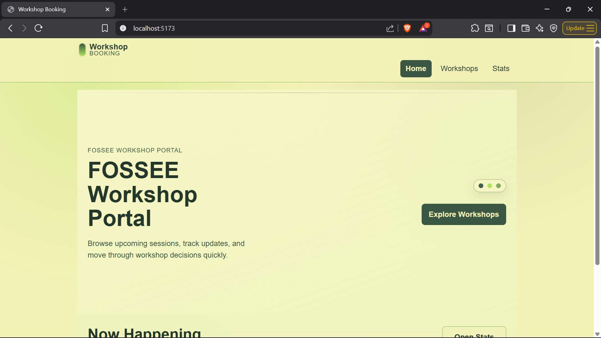

# Workshop Booking - Internship Submission

## Project summary

This submission focuses on frontend redesign for the Workshop Booking platform.  
The existing backend is Django, and backend behavior was kept unchanged as required.  
A separate React frontend was implemented in `frontend/` to improve UI quality while preserving current workflows.

## Scope completed

### React frontend setup

- Created a new React app in `frontend/`
- Used functional components only
- Added route-based navigation with React Router
- Kept folder structure simple:
  - `src/components`
  - `src/pages`
  - `src/styles`

### Implemented pages

- `Home` page with scroll-based narrative layout (hero to "Now Happening")
- `Workshops` page with search, list rows, and form feedback
- `Stats` page with loading state and readable metrics layout

### UI/UX work done

- Reworked homepage into a guided flow instead of generic card sections
- Improved navbar behavior for mobile and desktop
- Added micro-interactions (hover/active/focus) without heavy animations
- Adjusted visual system to be more distinctive and less template-like
- Tuned typography, spacing, and layout depth for better readability

### Accessibility and usability

- Semantic structure with clear heading hierarchy
- Keyboard-friendly navigation and menu close on `Escape`
- Visible focus indicators on interactive elements
- Form validation feedback with `aria-invalid` and `aria-describedby`
- Thumb-friendly controls for small screens

### Performance-focused decisions

- Used plain CSS (no heavy styling framework)
- Added lazy loading for page routes
- Kept component structure straightforward to avoid unnecessary re-renders
- Avoided large animation libraries and expensive visual effects

## Required responses

### 1) Design principles used

- Mobile-first layout decisions before desktop refinements
- Clear visual hierarchy for primary actions and page intent
- Progressive disclosure through scroll flow on homepage
- Minimal interaction complexity with richer visual presentation
- Consistent component behavior across pages

### 2) Mobile responsiveness approach

- Single-column default layout for narrow screens
- Breakpoint-based expansion for tablet and desktop
- Flexible spacing and text sizing without fixed-width dependency
- Touch-friendly buttons, links, and controls
- Navigation behavior designed for both tap and keyboard input

### 3) Trade-offs between design and performance

- Chose custom CSS over UI framework to keep payload smaller
- Limited motion to subtle transitions instead of heavy animations
- Added depth through color and composition rather than JS effects
- Prioritized fast loading and stable interaction over visual excess

### 4) Challenges and solutions

- **Challenge:** Existing project is Django-template based, while redesign requirement was React.
  - **Solution:** Built a separate React frontend layer to avoid backend disruption.

- **Challenge:** Need to make UI unique without hurting usability.
  - **Solution:** Used asymmetrical layouts and connected section flow while keeping actions obvious.

- **Challenge:** Navbar hover expansion initially shifted layout.
  - **Solution:** Switched to transform-based growth so only navbar changes visually while page remains anchored.

## How to run

From project root:

```bash
cd frontend
npm install
npm run dev
```

Open `http://localhost:5173`

## Build verification

```bash
npm run build
```

The frontend builds successfully with route chunks generated for `Home`, `Workshops`, and `Stats`.

##Screenshots

Screenshots are stored in `docs/screenshots/`.

### Current screenshot included




## Notes

- Backend Django code and business logic were not modified.
- Backend setup details remain available in `docs/Getting_Started.md`.
